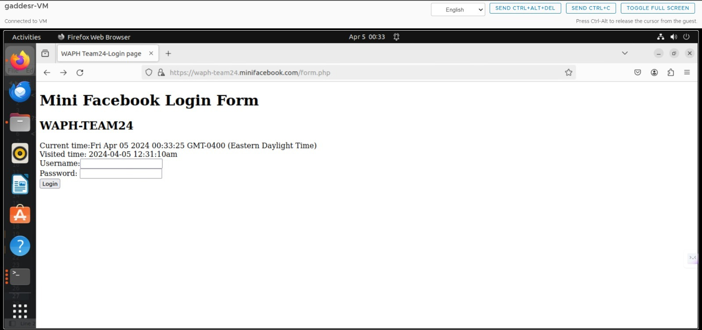
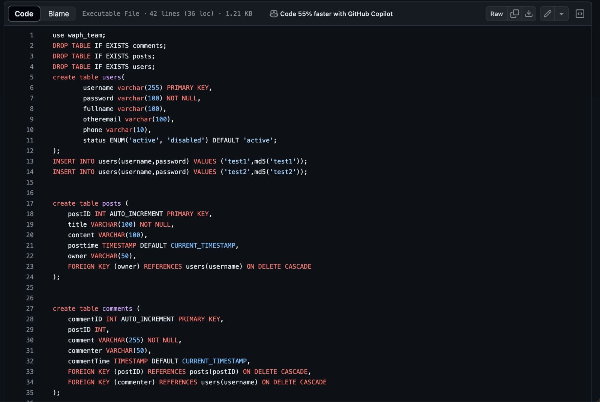
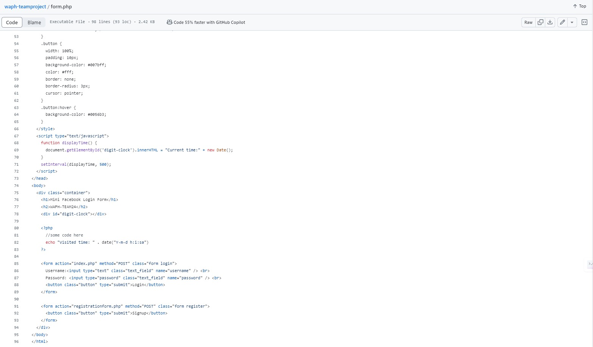
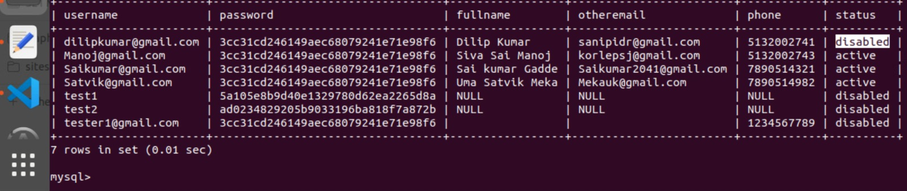

## Instructor: Dr. Phu Phung

# Mini-Facebook

# Team members

1. Sai Kumar Gadde, gaddesr@mail.uc.edu
2. Dilip Kumar Sanipina, sanipidr@mail.uc.edu
3. Uma Satwik Meka, mekauk@mail.uc.edu
4. Siva Sai Manoj Korlepara, korlepsj@mail.uc.edu

# Project Management Information

Source code repository (private access):  <https://github.com/waph-team10/waphteamproject/>

Project homepage (public): <https://github.com/waph-team24/waph-team24.github.io>

## Revision History

| Date        |   Version      |  Description |
|:------------|:-------------: |-------------:|
| 21/03/2024  |  0.0           | Sprint 0     |
| 04/04/2024  |  0.1           | Sprint 1     |
| 20/04/2024  |  0.2           | Sprint 2.    |
|24/04/2024   |  0.4           | Sprint 3     |   

# Overview
 
# System Analysis

(Start from Sprint 0, keep updating)

# Demo (screenshots)

# Software Process Management

(Start from Sprint 0, keep updating)

## Scrum process

All of our teammates uses Google Meet and Discord to communicate efficiently. We have a stand-up meeting on Google Meet every day to go over tasks and make sure everyone is informed of their responsibilities. With the help of this conference, we can identify any dependencies or hurdles so that we may tackle challenges head-on. Throughout the day, we exchange questions, quick updates, and quick cooperation via Discord. We speak often. At the conclusion of the day, we meet together to talk about what happened, evaluate our progress, and establish plans for the next day. This comprehensive approach to communication promotes accountability, transparency, and fruitful teamwork among our members.

### Sprint 0

Duration: 21/03/2024-27/03/2024

#### Completed Tasks: 

1. In sprint 0 we have created public and private repositories and name them as "Waph-teamproject" and                   " Waph-team24.github.io".
2. We have generated ssl keys and certificates for the team project and configure the https for the local domain.
3. We have develop the database for team project.
4. We also developed a individual home page for all of them and we have satisfied the requirements based on lab3 & lab4 for the team project.
5. We have tested the functionality using using index.html.

#### Contributions: 

1. Saikumar Gadde has done 7 commits over 5 hours and contributed in creating ssl keys and certificates for the team project amd creation of team personal home page.
2. Dilip Kumar Sanipina has done 4 commits over 4 hours and contributed in creating team repo's and public repo and database creation and contirbuted in developing form and index .php files.
3. Uma Satwik Meka has done 2 commits over 3 hours contributed in creation of setup database structure and index.html.
4. Manoj Kumar Korelpara has done 2 commits over 3 hours contributed in readme file and database setup.

### Sprint 1

Duration: 28/03/2024-07/03/2024

#### Completed Tasks: 

1. In sprint 1 we have completed designing the database and created the user-table,host tables and also created database-data.sql file.
2. we also created the user registration and login and change passwords

#### Contributions: 

1. Saikumar Gadde has done 5 commits over 6 hours and contributed in creating database design and developing database-data.sql 
2. Dilip Kumar Sanipina has done 3 commits over 5 hours and contributed in creating registration form and other php files. 
3. Uma Satwik Meka has done 2 commits over 4 hours contributed in modificarion of userregistrationform and index files.
4. Manoj Kumar Korelpara has done 2 commits over 3 hours contributed in dealing with change password and  creating readme file.

#### Database-account.sql
  sql
          create database waph_team;
          CREATE USER 'waph-team24'@'localhost' IDENTIFIED BY "team@24";
          GRANT ALL ON waph_team.* TO 'waph-team24'@'localhost';
 

#### Database-data.sql

 

- The ER (Entity-Relationship) diagram shows the structure and relationships between the "users" and "posts" tables. In the graphic, the "users" table is the primary entity, comprising characteristics such as "username," "password," "fullname," "otheremail," and "phone," with "username" serving as the primary key. This table contains information about specific system users, each of whom is recognized by a username.

- In contrast, the "posts" table stores information about user-created postings. It contains attributes such as "postID," "title," "content," "posttime," and "owner." Here, "postID" is the primary key. The "owner" field has a link with the "username" attribute in the "users" table, indicating who created each post. This relationship is represented as a one-to-many association, which means that one user can create several postings.

- Furthermore, the ER diagram exhibits referential integrity between the two tables using a foreign key constraint. The "owner" element in the "posts" table refers to the "username" field in the "users" table. This constraint requires a post's owner to be a genuine user in the system, eliminating orphaned records and maintaining data consistency. Furthermore, the ON DELETE CASCADE constraint given on the foreign key ensures that when a user is deleted from the system, all posts connected with that user are automatically removed, preventing referential integrity issues.

#### Form.php

#### changepassword.php

#### session_auth.php 

 

#### Registration_form.php

 

 

   

### SPRINT : 2

#### Completed Tasks:

##### Task-1: Database Restructuring
- Created new tables: posts, messages, comments for better data organization.
##### Task-2: User Post Viewing
- Implemented functionality allowing users to view posts of other users post-login.
##### Task-3: User Post Creation
- Enabled users to add new posts post-login.
##### Task-4: Post Editing and Deletion
- Restricted post editing and deletion to the original user for security and control purposes.
##### Task-5: Post Comments
- Implemented the ability for users to comment on posts made by others.
##### Task-6: Documentation Update
- Updated the README file to reflect changes made in this sprint.

#### Team Members Contribution:

1. Dilip Kumar Sanipina contribution in completing Task-3, Task-6, and updated Index.php file, 5 hours and 3 commits. 
2. Sai Kumar Gadde contribution 2 commits, 3 hours, contributed in Task-4 frontend and backend, and also made changes to database.php file.
3. Siva Sai Manoj Korlepara Contributed in Task-5, and Task-4 delete post with 2 commits and 3 hours. 
4. Uma Sathvik Meka contribution 2 commits,3 hours, contributed in Task-3 and contributed in solve the bugs and documentation 

### SPRINT :3 

#### Completed Tasks: 

- Here we have created database for superuser and created super userform.

- The super user can only diasble the registered users 

- here the user has been disabeled we can see the status of user.

#### SECURITY AND NON-FUNCTATIONAL REQUIREMENTS

- The system has been deployed on an HTTPS server, involving the creation and utilization of SSL keys to ensure secure communications. By generating SSL cryptographic keys, the system encrypts data transmitted between the server and clients, safeguarding it against eavesdropping and tampering. This deployment strategy enhances the security of sensitive transactions and data exchanges, making it crucial for systems handling confidential information.

- the passwords within the system are securely hashed before being stored in the database, enhancing security by protecting user credentials from being exposed in plain text. Additionally, the system's architecture avoids using the MySQL root account in the PHP code, which is a best practice to prevent unauthorized database access and potential security breaches. By not using the root account, the system minimizes risks associated with elevated privileges, further securing the database interactions.the passwords within the system are securely hashed before being stored in the database, enhancing security by protecting user credentials from being exposed in plain text. Additionally, the system's architecture avoids using the MySQL root account in the PHP code, which is a best practice to prevent unauthorized database access and potential security breaches. By not using the root account, the system minimizes risks associated with elevated privileges, further securing the database interactions.

- the system exclusively uses prepared statements for executing SQL queries. This approach enhances security by preventing SQL injection attacks, a common vulnerability where attackers can execute malicious SQL code. Prepared statements work by separating SQL logic from the data, ensuring that user input is treated strictly as data and not executable code. This method not only improves security but also optimizes query performance by allowing the database to reuse the same query plan for similar queries.

- the comprehensive security measures implemented across different layers of the application stack. Input validation is performed at the HTML layer to ensure that data entered through web forms adheres to expected formats, at the PHP layer to catch and sanitize any data before it is processed by the server, and at the SQL layer to prevent malicious data from affecting database operations. This multi-layered approach to validation is crucial for preventing common security threats such as cross-site scripting (XSS) and SQL injection, thereby safeguarding the integrity and security of the application

- the security practice of cleaning data before it is displayed on web pages, ensuring that it is free from malicious code that could lead to cross-site scripting (XSS) attacks. This process involves removing or encoding potentially dangerous characters and scripts from HTML content, thereby preventing attackers from injecting harmful scripts that could be executed in the browser of users visiting the site. Sanitization of HTML outputs is a critical security measure that protects both the website and its users from various types of cyber threats, maintaining the integrity and safety of the web environment.

- the implementation of role-based access control (RBAC) within the system, distinguishing between regular users and super users. This security model ensures that regular users do not have the permissions to log in as a superuser, maintaining a clear separation of privileges. Additionally, it restricts regular users from editing or updating posts made by other users, thereby enforcing strict access controls based on user roles. This approach is crucial for maintaining the integrity and confidentiality of the data, as it prevents unauthorized access and modifications, ensuring that each user can only perform actions within their designated permissions.

- the super user can only login into the admin page other users are restricted and can't login.The super user details are given at the time of database creation.

- the security measures implemented to protect user sessions from unauthorized access and manipulation. Session authentication involves verifying the identity of users whenever they initiate a session, ensuring that the user is genuinely who they claim to be. Additionally, measures to prevent session hijacking are in place, which protect active user sessions from being taken over by attackers through techniques like session fixation or session sidejacking. These strategies are vital for maintaining secure user interactions within the system, safeguarding both the user's credentials and their ongoing activities.

- Here , the implementation of measures to guard against cross-site request forgery (CSRF) attacks, a type of security threat where unauthorized commands are transmitted from a user that the web application trusts. CSRF protection typically involves the use of tokens that are validated with each client request to ensure that the request is intentional and originates from the authenticated user, not an attacker. This security measure is crucial for preventing attackers from exploiting the web application to perform unwanted actions on behalf of the authenticated user, thereby safeguarding user interactions and data integrity within the

- we have integrated the css styling to each page in our website.

 

# Appendix

- Demonstration video: <https://youtu.be/zywN3zHJUgs>

- Team website: <https://github.com/waph-team24/waph-team24.github.io>

- Source code: <https://waph-team24.minifacebook.com/form.php>

