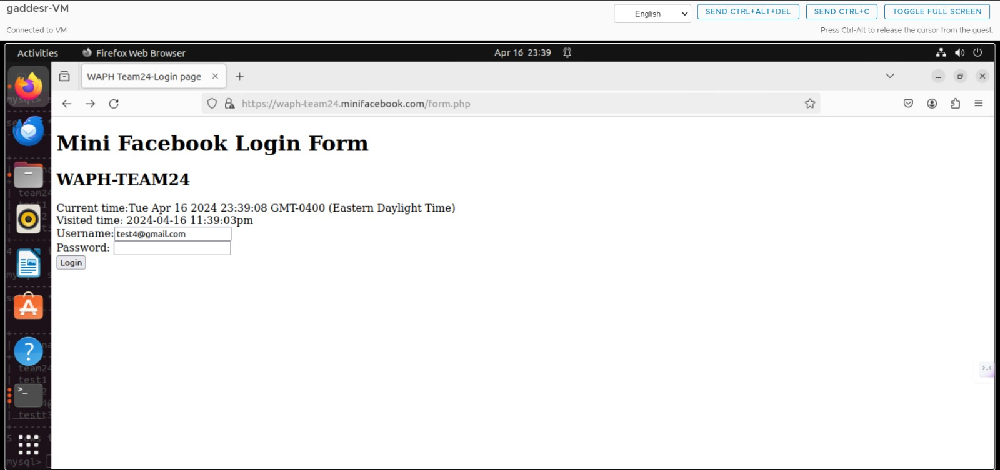
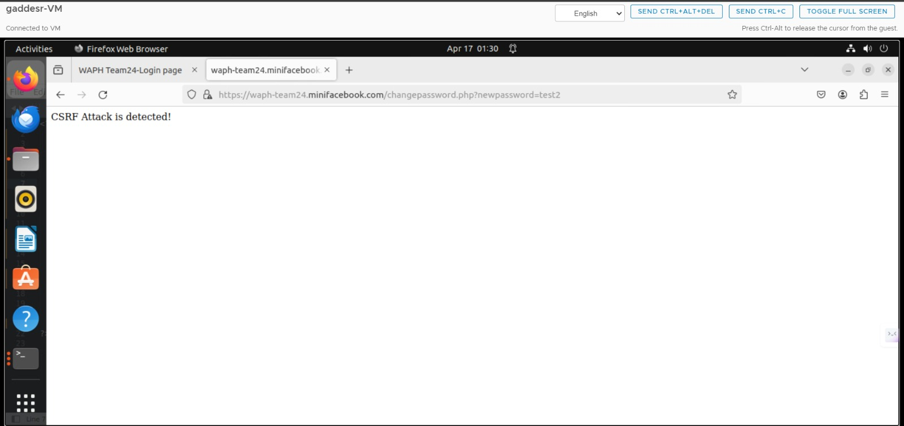
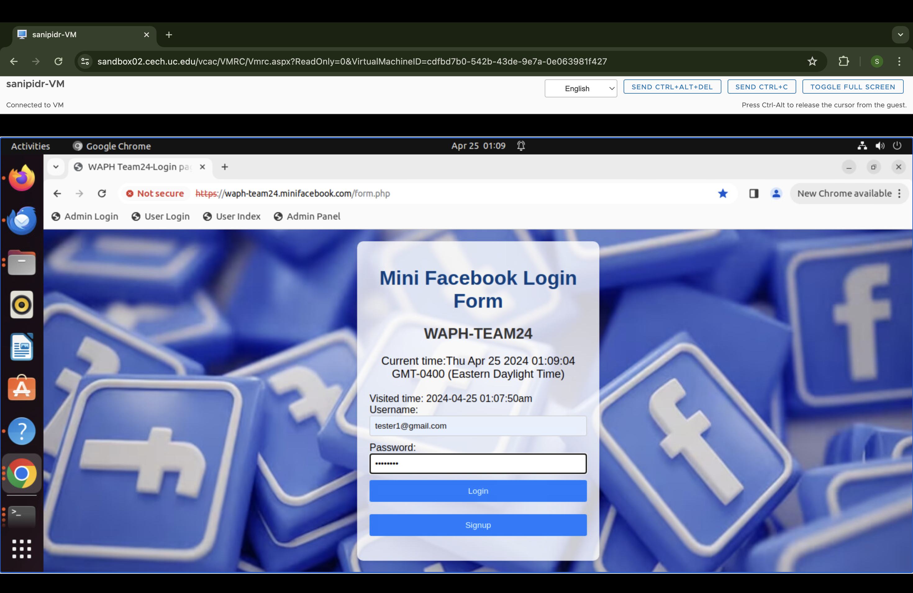
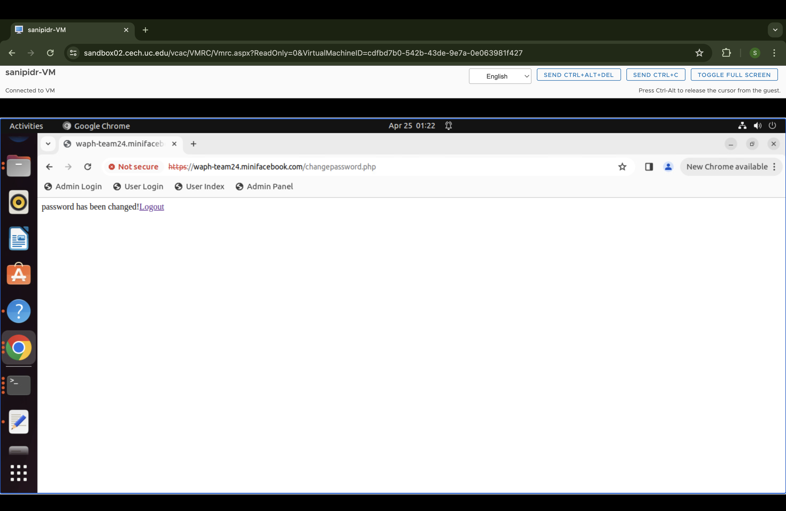

# WAPH-Web Application Programming and Hacking

## Instructor: Dr. Phu Phung

# Mini-Facebook

# Team members

1. Sai Kumar Gadde, gaddesr@mail.uc.edu
2. Dilip Kumar Sanipina, sanipidr@mail.uc.edu
3. Uma Satwik Meka, mekauk@mail.uc.edu
4. Siva Sai Manoj Korlepara, korlepsj@mail.uc.edu

# Project Management Information

Source code repository (private access):  <https://github.com/waph-team10/waphteamproject/>

Project homepage (public): <https://github.com/waph-team24/waph-team24.github.io>

## Revision History

| Date        |   Version      |  Description |
|:------------|:-------------: |-------------:|
| 21/03/2024  |  0.0           | Sprint 0     |
| 04/04/2024  |  0.1           | Sprint 1     |
| 20/04/2024  |  0.2           | Sprint 2.    |


# Overview
 
# System Analysis

_(Start from Sprint 0, keep updating)_

# Demo (screenshots)


# Software Process Management

_(Start from Sprint 0, keep updating)_


## Scrum process

All of our teammates uses Google Meet and Discord to communicate efficiently. We have a stand-up meeting on Google Meet every day to go over tasks and make sure everyone is informed of their responsibilities. With the help of this conference, we can identify any dependencies or hurdles so that we may tackle challenges head-on. Throughout the day, we exchange questions, quick updates, and quick cooperation via Discord. We speak often. At the conclusion of the day, we meet together to talk about what happened, evaluate our progress, and establish plans for the next day. This comprehensive approach to communication promotes accountability, transparency, and fruitful teamwork among our members.


### Sprint 0

Duration: 21/03/2024-27/03/2024

#### Completed Tasks: 

1. In sprint 0 we have created public and private repositories and name them as "Waph-teamproject" and                   " Waph-team24.github.io".
2. We have generated ssl keys and certificates for the team project and configure the https for the local domain.
3. We have develop the database for team project.
4. We also developed a individual home page for all of them and we have satisfied the requirements based on lab3 & lab4 for the team project.
5. We have tested the functionality using using index.html.

#### Contributions: 

1. Saikumar Gadde has done 7 commits over 5 hours and contributed in creating ssl keys and certificates for the team project amd creation of team personal home page.
2. Dilip Kumar Sanipina has done 4 commits over 4 hours and contributed in creating team repo's and public repo and database creation and contirbuted in developing form and index .php files.
3. Uma Satwik Meka has done 2 commits over 3 hours contributed in creation of setup database structure and index.html.
4. Manoj Kumar Korelpara has done 2 commits over 3 hours contributed in readme file and database setup.

### Sprint 1

Duration: 28/03/2024-07/03/2024

#### Completed Tasks: 

1. In sprint 1 we have completed designing the database and created the user-table,host tables and also created database-data.sql file.
2. we also created the user registration and login and change passwords

#### Contributions: 

1. Saikumar Gadde has done 5 commits over 6 hours and contributed in creating database design and developing database-data.sql 
2. Dilip Kumar Sanipina has done 3 commits over 5 hours and contributed in creating registration form and other php files. 
3. Uma Satwik Meka has done 2 commits over 4 hours contributed in modificarion of userregistrationform and index files.
4. Manoj Kumar Korelpara has done 2 commits over 3 hours contributed in dealing with change password and  creating readme file.


# Appendix

#### Database-account.sql
  ```sql
          create database waph_team;
          CREATE USER 'waph-team24'@'localhost' IDENTIFIED BY "team@24";
          GRANT ALL ON waph_team.* TO 'waph-team24'@'localhost';
 ```

#### Database-data.sql
 ```sql
          drop table if exists users; 
  drop table if exists messages; 
  drop table if exists sends; 
  drop table if exists received;

  create table users(
  	username varchar(255) PRIMARY KEY, 
  	password varchar(100) NOT NULL,
  	fullname varchar(100),
  	otheremail varchar(100),
  	phone varchar(10));
  INSERT INTO users(username,password) VALUES ('test1',md5('test1'));
  INSERT INTO users(username,password) VALUES ('test2',md5('test2'));

  drop table if exists posts; 
  create table posts(
  	postID int PRIMARY KEY, 
  	title varchar(100) NOT NULL,
  	content varchar(100),
  	posttime varchar(100),
  	owner varchar(100),
  	FOREIGN KEY (owner) REFERENCES users(username) ON DELETE CASCADE);

```


- The ER (Entity-Relationship) diagram shows the structure and relationships between the "users" and "posts" tables. In the graphic, the "users" table is the primary entity, comprising characteristics such as "username," "password," "fullname," "otheremail," and "phone," with "username" serving as the primary key. This table contains information about specific system users, each of whom is recognized by a username.

- In contrast, the "posts" table stores information about user-created postings. It contains attributes such as "postID," "title," "content," "posttime," and "owner." Here, "postID" is the primary key. The "owner" field has a link with the "username" attribute in the "users" table, indicating who created each post. This relationship is represented as a one-to-many association, which means that one user can create several postings.

- Furthermore, the ER diagram exhibits referential integrity between the two tables using a foreign key constraint. The "owner" element in the "posts" table refers to the "username" field in the "users" table. This constraint requires a post's owner to be a genuine user in the system, eliminating orphaned records and maintaining data consistency. Furthermore, the ON DELETE CASCADE constraint given on the foreign key ensures that when a user is deleted from the system, all posts connected with that user are automatically removed, preventing referential integrity issues.

#### Form.php

```html
          <!DOCTYPE html>
  <html lang="en">
  <head>
    <meta charset="utf-8">
    <title>WAPH Team24-Login page</title>
    <script type="text/javascript">
        function displayTime() {
          document.getElementById('digit-clock').innerHTML = "Current time:" + new Date();
        }
        setInterval(displayTime,500);
    </script>
  </head>
  <body>
    <h1>Mini Facebook Login Form</h1>
    <h2>WAPH-TEAM24</h2>
    <div id="digit-clock"></div>  
  <?php
    //some code here
    echo "Visited time: " . date("Y-m-d h:i:sa")
  ?>
    <form action="index.php" method="POST" class="form login">
      Username:<input type="text" class="text_field" name="username" /> <br>
      Password: <input type="password" class="text_field" name="password" /> <br>
      <button class="button" type="submit">Login</button>
    </form>
  </body>
  </html>

```  

 

#### index.php
```php
  <?php
      session_set_cookie_params(15*60,"/","waph-team24.minifacebook.com",TRUE,TRUE);
  	session_start();
  	require "database.php";
  	if(isset($_POST["username"]) and isset($_POST["password"])){    
  		if (checklogin_mysql($_POST["username"],$_POST["password"])) {
  			$_SESSION['authenticated'] = TRUE;
  			$_SESSION['username'] = $_POST["username"];	
  			$_SESSION["browser"] = $_SERVER["HTTP_USER_AGENT"];	
  		}else{
  			session_destroy();
  			echo "<script>alert('Invalid username/password');window.location='form.php';</script>";
  			die();
  		}
  	}
  	if(!isset($_SESSION['authenticated']) or $_SESSION['authenticated']!= TRUE){
          session_destroy();
          echo "<script>alert('You have not login.Please login first!')</script>";
          header("Refresh: 0; url=form.php");
          die();
  	}	
  	if ($_SESSION["browser"] != $_SERVER["HTTP_USER_AGENT"]){
  		session_destroy();
  		echo "<script>alert('Session hijacking attack is detected!');</script>";
  		header("Refresh:0; url=form.php");
  		die();
  	}
  	
  ?>
  		<h2> Welcome <?php echo htmlentities( $_SESSION['username']); ?> !</h2>
          <a href ="changepasswordform.php">Change password</a> | <a href ="profile.php">Edit profile</a> | <a href= "logout.php">Logout</a>
 ```


#### changepassword.php
```php
  <?php
    require "session_auth.php";
    require "database.php";
    $token = $_POST['nocsrftoken'];
    if (!isset($token) or $token!=$_SESSION['nocsrftoken']) {
       echo "CSRF Attack is detected!";
       die();
    }
    $username = $_SESSION['username'];
    $password = $_REQUEST['password'];
    if (isset($username) and isset($password)) {
      echo "Debug> Changepassword.php got username=$username;newpassword=$password";
         if(changepassword($username,$password)){
              echo "password has been changed!";
          }else{
              echo " Change password Failed!";
          }
    }else{
       echo " No username/password provided!";
    }   
      
  ?>

```


#### session_auth.php 


```php

  <?php
      session_set_cookie_params(15*60,"/","waph-team24.minifacebook.com",TRUE,TRUE);
  	session_start();
  	if(!isset($_SESSION['authenticated']) or $_SESSION['authenticated']!= TRUE){
          session_destroy();
          echo "<script>alert('You have not login.Please login first!')</script>";
          header("Refresh: 0; url=form.php");
          die();
  	}	
  	if ($_SESSION["browser"] != $_SERVER["HTTP_USER_AGENT"]){
  		session_destroy();
  		echo "<script>alert('Session hijacking attack is detected!');</script>";
  		header("Refresh:0; url=form.php");
  		die();
  	}

```

 

 


#### Registration_form.php

 ```php

  <!DOCTYPE html>
  <html lang="en">
  <head>
    <meta charset="utf-8">
    <title>WAPH-Login page</title>
    <script type="text/javascript">
        function displayTime() {
          document.getElementById('digit-clock').innerHTML = "Current time:" + new Date();
        }
        setInterval(displayTime,500);
    </script>
  </head>
  <body>
    <h1>New User registration, WAPH</h1>
    <h2>TEAM-24</h2>
    <div id="digit-clock"></div>  
  <?php
    //some code here
        echo "Visited time: " . date("Y-m-d h:i:sa")
  ?>
    <form action="addnewuser.php" method="POST" class="form login">
      Username:<input type="text" class="text_field" name="username" required 
      pattern="^[\w.-]+@[\w-]+(.[\w-]+)*$"
      title="Email address is required as username"
      placeholder="Username is email"
      onchange="this.setCustomeValidity(this.validity.patternMismatch?this.title: ' ');" /> <br>
      Password: <input type="password" class="text_field" name="password" /> <br>
      <button class="button" type="submit">Login</button>
    </form>
  </body>
  </html>

```


  


    

 ### SPRINT : 2

#### Completed Tasks:

##### Task-1: Database Restructuring
Created new tables: posts, messages, comments for better data organization.
##### Task-2: User Post Viewing
Implemented functionality allowing users to view posts of other users post-login.
##### Task-3: User Post Creation
Enabled users to add new posts post-login.
##### Task-4: Post Editing and Deletion
Restricted post editing and deletion to the original user for security and control purposes.
##### Task-5: Post Comments
Implemented the ability for users to comment on posts made by others.
##### Task-6: Documentation Update
Updated the README file to reflect changes made in this sprint.

 





#### Team Members Contribution:

1. Dilip Kumar Sanipina contribution in completing Task-3, Task-6, and updated Index.php file, 5 hours and 3 commits. 
2. Sai Kumar Gadde contribution 2 commits, 3 hours, contributed in Task-4 frontend and backend, and also made changes to database.php file.
3. Siva Sai Manoj Korlepara Contributed in Task-5, and Task-4 delete post with 2 commits and 3 hours. 
4. Uma Sathvik Meka contribution 2 commits,3 hours, contributed in Task-3 and contributed in solve the bugs and documentation


